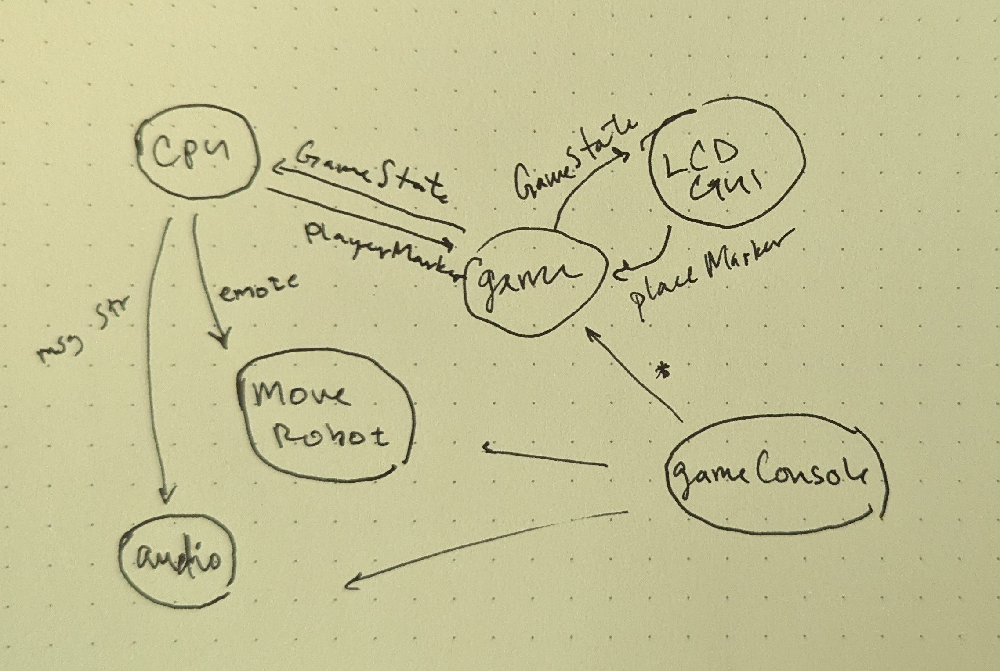

# ROB 421 Tic Tac Toe Game
   
  
  
### Dependencies:
    - ROS2 Jazzy
    - curses (no install needed on linux)  
    - Misty-SDK  
    - tkinter

### Tic Tac Toe Game Node:  
`ros2 run sami_ttt ttt_game`  
This is the node which holds all of the game logic.  
It has a service call to get player inputs, and calculates the best spot for misty to place depending on the difficulty level.  
This node calls the misty control node to send a string to speak and a movement to play.  
Currently misty places on the board as soon as the animation starts. This can be fixed by spin until futue complete,  
though this would hang the game node and has not been fully debugged.  
  
### Board GUI:
`ros2 run sami_ttt ttt_gui`  
This is John's GUI using the LCD screen. Displays the board with tkinter and relays the user's input with the service call to `ttt_game`.  
Also passes the "restart game" service call and displays the robot and player win parameters.
   
  
### Misty Controller:  
`ros2 run sami_ttt misty_control`  
This is a node that sends misty behaviors. Using a movement bank, this sends one misty API call at a time for a full animation.  
The action call to move the robot has a string in the goal which is passed to misty's internal text to speech and speakers.  
  
### UI Controller:
`ros2 run sami_ttt ttt_console`  
This is a shell like UI built with curses.  
This can manually run the game and can test each node with appropriate service / action calls.  
Tic Tac Toe can be run without this console. Earlier version with sami allowed the console to test connecting, sending jsons etc.  
The console may not work completely as intended since the auto start feature was added to the game node--you may need to request a new game via input mode.  
Available input mode commands:
- `newgame`: starts a new game
- `turn <player_id> <location>` where location is 0-8, [0 1 2] [3 4 5] [6 7 8] are the three rows of the board.
  
The UI shows the running game log. For a node's log message to show up on the main UI:  
publish type `GameLog` msg to topic `game_log`  
This will show the timestamp, node of origin, and log message in the console window.  
I like to create a class method `log(self, msg:str)` where this string is published to `self.get_logger().info(msg)` and topic `game_log`. 